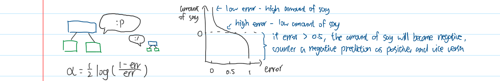
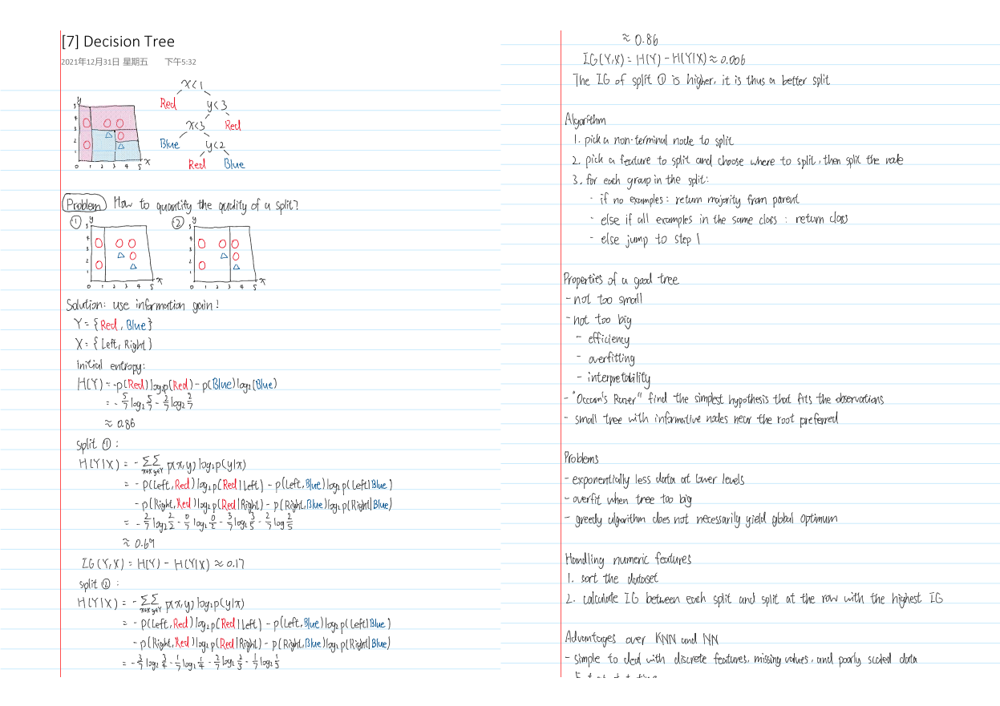

# Machine Learning Notes

Notes for machine learning

### Contents

* Logistic Regression
* Softmax
* Support Vector Machine
* Back Propagation
* Entropy
* Decision Tree
* Random Forest
* AdaBoost
* Maximum Likelihood Estimation
* Bayes' Theorem
* Naïve Bayes Classifier
* K-Means

### TODO

* Add more topics
* Refine

### Files

`Machine Learning Notes.pdf` Notes in PDF format

`Machine Learning Notes Booklet.pdf` Notes in PDF format; rearranged so that it can be printed into a booklet (left-binding, flips on the short edge)

